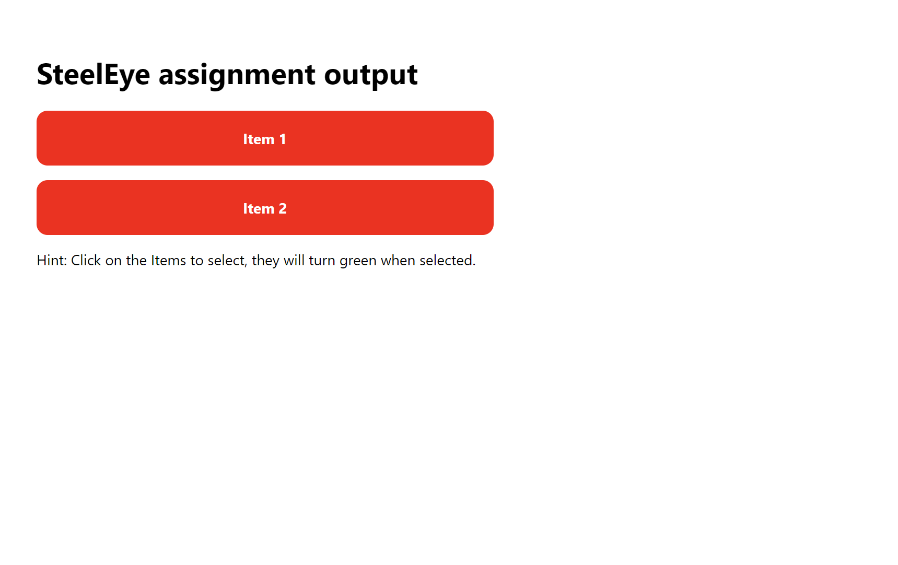
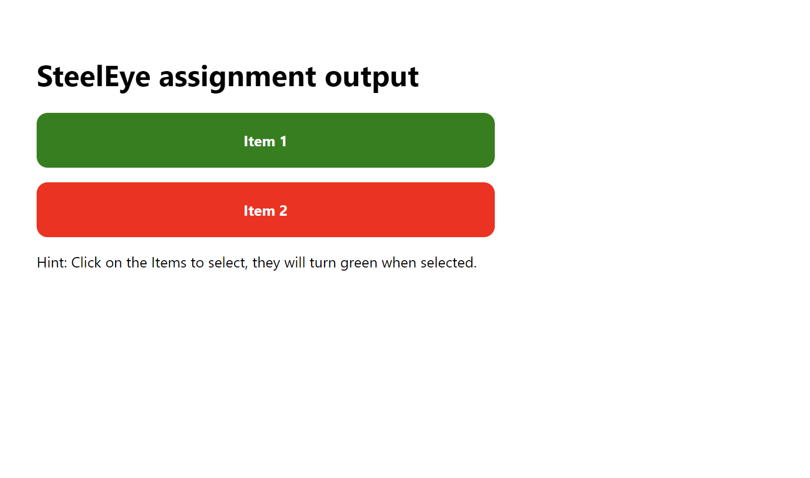

# SteelEye Assignment

---

Name - Pranav Goel

Reg No - 12007944

1.  Explain what the simple `List` component does.
    
    The List component in our React application renders an unordered list of items passed to it as props. Each item is represented as a memoized functional component named "SingleListItem". The component receives various props such as the item's index, a boolean value indicating whether the item is selected or not, a click handler function, and the item's display text.
    
    The List component maintains its own state using the useState hook to keep track of the selected item's index. Whenever an item is clicked, the handleClick function is invoked with the clicked item's index. The function then updates the component's state using the setSelectedIndex function.
    
    Each SingleListItem component receives an isSelected prop which is a boolean value that reflects whether the item at the given index is currently selected, based on the selected index stored in the List component's state. If the index matches the selected index, the item is highlighted with a green background, otherwise, it has a red background.
    
    The List component also uses the useEffect hook to reset the selected index to null whenever there is a change in the items prop. This ensures that any previously selected item is deselected when the list is updated with new items. Additionally, the List component has a default props definition for the items prop, setting it to null if not provided.
    
    In summary, the List component provides a mechanism for users to select a single item from a list of items and displays visual feedback on which item is currently selected. It uses various React hooks such as useState, useEffect, and memo to maintain its state and optimize its rendering performance.
    

1. What problems / warnings are there with code?

There are several issues with the provided code:

1. In the SingleListItem component, the onClickHandler prop is being passed the result of calling the handleClick function instead of the function itself. This will result in the handleClick function being called immediately when the component is rendered, instead of when the item is clicked. To fix this, the onClickHandler prop should be passed a function that calls the handleClick function when the item is clicked, like this: onClick={() => onClickHandler(index)}
2. In the propTypes definition for the WrappedListComponent, the items prop is defined as an array of objects with a "text" property that is a required string. However, the correct syntax is to use the "shape" validator in conjunction with the "arrayOf" validator. The correct propTypes definition for items should be: items: PropTypes.arrayOf(PropTypes.shape({ text: PropTypes.string.isRequired }))
3. In the WrappedListComponent component, the selectedIndex variable initialized by the useState hook should be set to null instead of undefined. The following line needs to be changed: const [setSelectedIndex, selectedIndex] = useState()
4. In the SingleListItem component, the isSelected prop is being passed the selectedIndex state variable instead of a boolean value. The following line needs to be changed: isSelected={selectedIndex}
5. In the WrappedListComponent component, a unique key needs to be provided for each SingleListItem component to help React efficiently render the list. The following line needs to be changed: <SingleListItem .../>
6. In the given code, the map() method is being used without any data being passed from the App component. Additionally, the selectedIndex variable is being initialized to null by default, resulting in an error. To address this, a default prop for the data can be set to ensure that the map() method has valid data to work with, even if it is not passed from the App component.
7. Lastly, the state setter function, setSelectedIndex, is defined incorrectly in the WrappedListComponent. The line const [setSelectedIndex, selectedIndex] = useState(); should be changed to const [selectedIndex, setSelectedIndex] = useState(null); to ensure that the initial value of the selectedIndex variable is set to null.

1. Please fix, optimize, and/or modify the component as much as you think is necessary.

```cpp
//  'memo' is is not being used anywhere after modifying the code so we can avoid importing it.
// import React, { useState, useEffect, memo } from "react";

import React, { useState, useEffect } from "react";
import "./list.css";
import PropTypes from "prop-types";

// Single List Item
const WrappedSingleListItem = ({ index, isSelected, onClickHandler, text }) => {
  return (
    <li
      style={{ backgroundColor: isSelected ? "green" : "red" }}
      // The onClick event was not passed correctly. It should be onClick={() => onClickHandler(index)} and not onClick={onClickHandler(index)}. To pass a parameter in a function in the 'onClick' event the attribute should be returned by an arrow function.
      onClick={() => onClickHandler(index)}
    >
      {text}
    </li>
  );
};

WrappedSingleListItem.propTypes = {
  // Index and isSelected should be set as required props
  index: PropTypes.number.isRequired,
  isSelected: PropTypes.bool.isRequired,
  onClickHandler: PropTypes.func.isRequired,
  text: PropTypes.string.isRequired,
};

// Here, memo is of no use so we can simply remove it

// const SingleListItem = memo(WrappedSingleListItem);
const SingleListItem = WrappedSingleListItem;

// List Component
const WrappedListComponent = ({ items }) => {
  // Swap the order of the setSelectedIndex and selectedIndex variables in the useState hook.
  const [selectedIndex, setSelectedIndex] = useState(null);

  useEffect(() => {
    setSelectedIndex(null);
  }, [items]);

  const handleClick = (index) => {
    setSelectedIndex(index);
  };

  return (
    <ul>
      {items &&
        items.map((item, index) => (
          <SingleListItem
            // Each child in a list should have a unique "key" prop. In WrappedListComponent, the key prop was missing in SingleListItem component. This can lead to performance issues when rendering large lists.
            key={index}
            onClickHandler={() => handleClick(index)}
            text={item.text}
            index={index}
            // isSelected prop should pass a boolean value
            isSelected={index === selectedIndex}
          />
        ))}
    </ul>
  );
};

// Syntax errors - 'array' should be 'arrayOf' and 'shapeOf' should be 'shape'
WrappedListComponent.propTypes = {
  items: PropTypes.arrayOf(
    PropTypes.shape({
      text: PropTypes.string.isRequired,
    })
  ),
};

// The default value for items in WrappedListComponent should not be null . It should be set to an array as we are mapping on this prop in the WrapoedListComponent and passing it's value to the SingleListItem
WrappedListComponent.defaultProps = {
  items: [{ text: "Item 1" }, { text: "Item 2" }],
};

// Here, memo is of no use so we can simply remove it

// const List = memo(WrappedListComponent);
const List = WrappedListComponent;

export default List;
```

## Output:



When item is selected:

